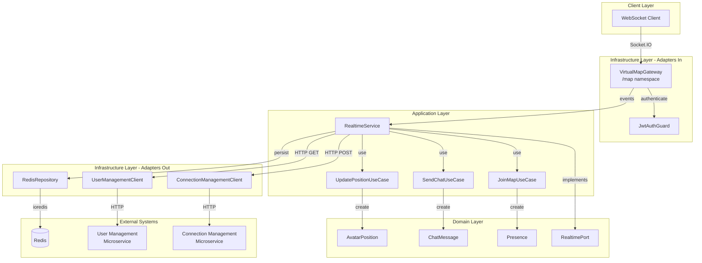

# Design Document: peerly-realtime-management

## Overview

El microservicio **peerly-realtime-management** implementa comunicación en tiempo real para la red social universitaria Peerly mediante WebSocket (Socket.IO). Gestiona la presencia de usuarios en un mapa virtual, actualizaciones de posiciones de avatares y chat temporal.

### Objetivos del Diseño

- **Comunicación bidireccional en tiempo real**: Utilizar Socket.IO para eventos WebSocket eficientes
- **Escalabilidad horizontal**: Soportar múltiples instancias mediante Redis Adapter
- **Arquitectura hexagonal**: Mantener separación clara entre domain, application e infrastructure
- **Integración con microservicios**: Comunicarse con User Management y Connection Management vía HTTP
- **Almacenamiento efímero**: Usar Redis para datos temporales con TTL automático
- **Autenticación robusta**: Validar JWT en todas las conexiones WebSocket

### Tecnologías Principales

- **NestJS**: Framework para estructura modular y dependency injection
- **Socket.IO**: Biblioteca WebSocket con fallback y reconexión automática
- **Redis**: Almacenamiento efímero y sincronización entre instancias
- **ioredis**: Cliente Redis para operaciones directas
- **@socket.io/redis-adapter**: Adaptador para escalabilidad horizontal
- **@nestjs/jwt**: Validación de tokens JWT

## Architecture

### Arquitectura Hexagonal

El microservicio sigue arquitectura hexagonal (ports and adapters) con tres capas principales:

```
contexts/realtime/
├── domain/              # Núcleo de negocio (entities, ports)
├── application/         # Casos de uso y servicios de aplicación
└── infrastructure/      # Adaptadores externos (WebSocket, Redis, HTTP)
```

#### Domain Layer

Contiene la lógica de negocio pura sin dependencias externas:

- **Entities**: AvatarPosition, ChatMessage, Presence
- **Ports**: Interfaces que definen contratos para adaptadores externos
- **Value Objects**: Coordenadas, timestamps, identificadores

#### Application Layer

Orquesta casos de uso y coordina entre domain e infrastructure:

- **Services**: RealtimeService (lógica de negocio principal)
- **Use Cases**: JoinMapUseCase, UpdatePositionUseCase, SendChatUseCase
- **DTOs**: Objetos de transferencia de datos para eventos WebSocket

#### Infrastructure Layer

Implementa adaptadores para comunicación externa:

- **Adapters In**: VirtualMapGateway (WebSocket)
- **Adapters Out**: UserManagementClient, ConnectionManagementClient (HTTP)
- **Persistence**: RedisRepository (almacenamiento efímero)
- **Guards**: JwtAuthGuard (autenticación WebSocket)

### Diagrama de Arquitectura



### Flujo de Datos Principal

1. **Conexión**: Cliente → VirtualMapGateway → JwtAuthGuard → RealtimeService
2. **Join Map**: RealtimeService → UserManagementClient → RedisRepository → Broadcast
3. **Update Position**: RealtimeService → RedisRepository → Broadcast (throttled)
4. **Send Chat**: RealtimeService → RedisRepository → Broadcast
5. **Disconnect**: RealtimeService → RedisRepository (cleanup) → Broadcast

## Components and Interfaces

### 1. VirtualMapGateway (Infrastructure - Adapter In)

**Responsabilidad**: Manejar conexiones WebSocket y eventos en el namespace /map

**Tecnología**: `@nestjs/websockets`, `@nestjs/platform-socket.io`

```typescript
@WebSocketGateway({
  namespace: '/map',
  cors: { origin: '*' }
})
export class VirtualMapGateway implements OnGatewayConnection, OnGatewayDisconnect {
  @WebSocketServer() server: Server;
  
  constructor(private readonly realtimeService: RealtimeService) {}
  
  // Lifecycle hooks
  async handleConnection(client: Socket): Promise<void>
  async handleDisconnect(client: Socket): Promise<void>
  
  // Event handlers
  @SubscribeMessage('joinMap')
  async handleJoinMap(client: Socket): Promise<void>
  
  @SubscribeMessage('updatePosition')
  async handleUpdatePosition(client: Socket, payload: UpdatePositionDto): Promise<void>
  
  @SubscribeMessage('sendChat')
  async handleSendChat(client: Socket, payload: SendChatDto): Promise<void>
}
```

**Configuración**:
- Namespace: `/map`
- CORS: Habilitado para todos los orígenes
- Redis Adapter: Configurado para escalabilidad horizontal

**Eventos Entrantes**:
- `joinMap`: Usuario se une al mapa
- `updatePosition`: Actualización de posición del avatar
- `sendChat`: Envío de mensaje de chat

**Eventos Salientes**:
- `userJoined`: Notificación de nuevo usuario
- `userLeft`: Notificación de usuario desconectado
- `positionUpdate`: Actualización de posición de otro usuario
- `chatMessage`: Nuevo mensaje de chat
- `error`: Error en procesamiento de evento

### 2. JwtAuthGuard (Infrastructure - Guard)

**Responsabilidad**: Validar tokens JWT en conexiones WebSocket

```typescript
@Injectable()
export class JwtAuthGuard implements CanActivate {
  constructor(private readonly jwtService: JwtService) {}
  
  async canActivate(context: ExecutionContext): Promise<boolean> {
    const client: Socket = context.switchToWs().getClient();
    const token = this.extractToken(client);
    
    if (!token) {
      throw new WsException('Authentication token missing');
    }
    
    try {
      const payload = await this.jwtService.verifyAsync(token);
      client.data.user = payload;
      return true;
    } catch (error) {
      throw new WsException('Invalid authentication token');
    }
  }
  
  private extractToken(client: Socket): string | null {
    return client.handshake.auth.token || 
           client.handshake.headers.authorization?.replace('Bearer ', '');
  }
}
```

**Extracción de Token**:
1. Primero intenta `client.handshake.auth.token`
2. Si no existe, intenta `client.handshake.headers.authorization`
3. Remueve prefijo "Bearer " si existe

**Almacenamiento de Usuario**:
- Payload decodificado se almacena en `client.data.user`
- Disponible en todos los event handlers

### 3. RealtimeService (Application Layer)

**Responsabilidad**: Orquestar lógica de negocio para eventos en tiempo real

```typescript
@Injectable()
export class RealtimeService {
  constructor(
    private readonly redisRepository: RedisRepository,
    private readonly userManagementClient: UserManagementClient,
    private readonly connectionManagementClient: ConnectionManagementClient,
  ) {}
  
  async handleUserJoin(userId: string, socketId: string): Promise<UserJoinedEvent>
  async handleUserLeave(userId: string, socketId: string): Promise<UserLeftEvent>
  async updatePosition(userId: string, x: number, y: number): Promise<PositionUpdateEvent>
  async sendChatMessage(userId: string, message: string): Promise<ChatMessageEvent>
  async getAllActivePositions(): Promise<AvatarPosition[]>
  async createPresence(userId: string, socketId: string): Promise<void>
  async removePresence(userId: string, socketId: string): Promise<void>
}
```

**Métodos Principales**:

- `handleUserJoin`: Crea presencia, obtiene perfil de usuario, retorna evento
- `handleUserLeave`: Elimina presencia, retorna evento
- `updatePosition`: Almacena posición con TTL, retorna evento (throttled en gateway)
- `sendChatMessage`: Valida mensaje, almacena con TTL, retorna evento
- `getAllActivePositions`: Recupera todas las posiciones activas de Redis
- `createPresence`: Crea registro de presencia en Redis
- `removePresence`: Elimina registro de presencia de Redis

**Validaciones**:
- Mensaje no vacío
- Mensaje máximo 500 caracteres
- Coordenadas numéricas válidas

### 4. RedisRepository (Infrastructure - Persistence)

**Responsabilidad**: Gestionar almacenamiento efímero en Redis

```typescript
@Injectable()
export class RedisRepository {
  private readonly redis: Redis;
  
  constructor() {
    this.redis = new Redis({
      host: process.env.REDIS_HOST || 'localhost',
      port: parseInt(process.env.REDIS_PORT) || 6379,
    });
  }
  
  // Presence operations
  async setPresence(userId: string, socketId: string): Promise<void>
  async getPresence(userId: string): Promise<string | null>
  async deletePresence(userId: string): Promise<void>
  
  // Position operations
  async setPosition(userId: string, position: AvatarPosition, ttl: number): Promise<void>
  async getPosition(userId: string): Promise<AvatarPosition | null>
  async getAllPositions(): Promise<AvatarPosition[]>
  
  // Chat operations
  async setChatMessage(messageId: string, message: ChatMessage, ttl: number): Promise<void>
  async getChatMessage(messageId: string): Promise<ChatMessage | null>
}
```

**Patrones de Keys**:
- Presencia: `presence:{userId}` → `{socketId}`
- Posición: `position:{userId}` → `{x, y, timestamp}`
- Chat: `chat:{messageId}` → `{userId, message, timestamp}`

**TTL (Time To Live)**:
- Presencia: Sin TTL (eliminación manual en disconnect)
- Posición: 300 segundos (5 minutos)
- Chat: 60 segundos (1 minuto)

**Operaciones**:
- `set*`: Almacena con serialización JSON
- `get*`: Recupera y deserializa JSON
- `delete*`: Elimina key
- `getAllPositions`: Escanea keys con patrón `position:*`

### 5. UserManagementClient (Infrastructure - Adapter Out)

**Responsabilidad**: Comunicación HTTP con microservicio User Management

```typescript
@Injectable()
export class UserManagementClient {
  private readonly httpService: HttpService;
  private readonly baseUrl: string;
  
  constructor(httpService: HttpService) {
    this.httpService = httpService;
    this.baseUrl = process.env.USER_MANAGEMENT_URL;
  }
  
  async getUserById(userId: string): Promise<UserProfile | null> {
    try {
      const response = await this.httpService.axiosRef.get(
        `${this.baseUrl}/users/${userId}`
      );
      return response.data;
    } catch (error) {
      console.error(`Failed to fetch user ${userId}:`, error.message);
      return null;
    }
  }
}
```

**Endpoint**:
- `GET /users/{userId}`: Obtiene perfil de usuario

**Manejo de Errores**:
- Si falla, retorna `null`
- Servicio continúa operando con solo `userId` del JWT
- Error se registra en logs

**Respuesta Esperada**:
```typescript
interface UserProfile {
  id: string;
  name: string;
  email: string;
}
```

### 6. ConnectionManagementClient (Infrastructure - Adapter Out)

**Responsabilidad**: Comunicación HTTP con microservicio Connection Management

```typescript
@Injectable()
export class ConnectionManagementClient {
  private readonly httpService: HttpService;
  private readonly baseUrl: string;
  
  constructor(httpService: HttpService) {
    this.httpService = httpService;
    this.baseUrl = process.env.CONNECTION_MANAGEMENT_URL;
  }
  
  async createConnectionRequest(requesterId: string, receiverId: string): Promise<void> {
    try {
      await this.httpService.axiosRef.post(
        `${this.baseUrl}/connections`,
        { requesterId, receiverId }
      );
    } catch (error) {
      console.error('Failed to create connection request:', error.message);
      // Continue normal operation
    }
  }
}
```

**Endpoint**:
- `POST /connections`: Crea solicitud de conexión

**Payload**:
```typescript
{
  requesterId: string;
  receiverId: string;
}
```

**Manejo de Errores**:
- Si falla, solo registra error
- Servicio continúa operando normalmente
- No afecta flujo principal de realtime

### 7. Use Cases (Application Layer)

#### JoinMapUseCase

```typescript
@Injectable()
export class JoinMapUseCase {
  constructor(
    private readonly redisRepository: RedisRepository,
    private readonly userManagementClient: UserManagementClient,
  ) {}
  
  async execute(userId: string, socketId: string): Promise<UserJoinedEvent> {
    // Create presence
    await this.redisRepository.setPresence(userId, socketId);
    
    // Fetch user profile
    const userProfile = await this.userManagementClient.getUserById(userId);
    
    // Return event data
    return {
      userId,
      name: userProfile?.name || 'Unknown',
      email: userProfile?.email || '',
      timestamp: new Date().toISOString(),
    };
  }
}
```

#### UpdatePositionUseCase

```typescript
@Injectable()
export class UpdatePositionUseCase {
  constructor(private readonly redisRepository: RedisRepository) {}
  
  async execute(userId: string, x: number, y: number): Promise<PositionUpdateEvent> {
    const position = new AvatarPosition(userId, x, y);
    await this.redisRepository.setPosition(userId, position, 300);
    
    return {
      userId,
      x,
      y,
      timestamp: new Date().toISOString(),
    };
  }
}
```

#### SendChatUseCase

```typescript
@Injectable()
export class SendChatUseCase {
  constructor(
    private readonly redisRepository: RedisRepository,
    private readonly userManagementClient: UserManagementClient,
  ) {}
  
  async execute(userId: string, message: string): Promise<ChatMessageEvent> {
    // Validate message
    if (!message || message.trim().length === 0) {
      throw new Error('Message cannot be empty');
    }
    if (message.length > 500) {
      throw new Error('Message exceeds maximum length of 500 characters');
    }
    
    // Create chat message
    const messageId = `${userId}-${Date.now()}`;
    const chatMessage = new ChatMessage(userId, message);
    await this.redisRepository.setChatMessage(messageId, chatMessage, 60);
    
    // Fetch user profile
    const userProfile = await this.userManagementClient.getUserById(userId);
    
    return {
      userId,
      name: userProfile?.name || 'Unknown',
      message,
      timestamp: new Date().toISOString(),
    };
  }
}
```

## Data Models

### Domain Entities

#### AvatarPosition

```typescript
export class AvatarPosition {
  constructor(
    public readonly userId: string,
    public readonly x: number,
    public readonly y: number,
    public readonly timestamp: Date = new Date(),
  ) {}
  
  toJSON(): object {
    return {
      userId: this.userId,
      x: this.x,
      y: this.y,
      timestamp: this.timestamp.toISOString(),
    };
  }
  
  static fromJSON(data: any): AvatarPosition {
    return new AvatarPosition(
      data.userId,
      data.x,
      data.y,
      new Date(data.timestamp),
    );
  }
}
```

**Propiedades**:
- `userId`: Identificador único del usuario
- `x`: Coordenada X en el mapa virtual
- `y`: Coordenada Y en el mapa virtual
- `timestamp`: Momento de la última actualización

**Persistencia**:
- Redis key: `position:{userId}`
- TTL: 300 segundos
- Formato: JSON serializado

#### ChatMessage

```typescript
export class ChatMessage {
  public readonly id: string;
  public readonly timestamp: Date;
  
  constructor(
    public readonly userId: string,
    public readonly message: string,
  ) {
    this.id = `${userId}-${Date.now()}`;
    this.timestamp = new Date();
  }
  
  toJSON(): object {
    return {
      id: this.id,
      userId: this.userId,
      message: this.message,
      timestamp: this.timestamp.toISOString(),
    };
  }
  
  static fromJSON(data: any): ChatMessage {
    const chatMessage = new ChatMessage(data.userId, data.message);
    (chatMessage as any).id = data.id;
    (chatMessage as any).timestamp = new Date(data.timestamp);
    return chatMessage;
  }
}
```

**Propiedades**:
- `id`: Identificador único del mensaje (generado)
- `userId`: Identificador del usuario que envió el mensaje
- `message`: Contenido del mensaje (máximo 500 caracteres)
- `timestamp`: Momento de creación del mensaje

**Validaciones**:
- Mensaje no vacío
- Longitud máxima: 500 caracteres

**Persistencia**:
- Redis key: `chat:{messageId}`
- TTL: 60 segundos
- Formato: JSON serializado

#### Presence

```typescript
export class Presence {
  constructor(
    public readonly userId: string,
    public readonly socketId: string,
    public readonly connectedAt: Date = new Date(),
  ) {}
  
  toJSON(): object {
    return {
      userId: this.userId,
      socketId: this.socketId,
      connectedAt: this.connectedAt.toISOString(),
    };
  }
  
  static fromJSON(data: any): Presence {
    return new Presence(
      data.userId,
      data.socketId,
      new Date(data.connectedAt),
    );
  }
}
```

**Propiedades**:
- `userId`: Identificador único del usuario
- `socketId`: Identificador de la conexión Socket.IO
- `connectedAt`: Momento de conexión

**Persistencia**:
- Redis key: `presence:{userId}`
- TTL: Sin TTL (eliminación manual)
- Formato: JSON serializado

### DTOs (Data Transfer Objects)

#### UpdatePositionDto

```typescript
export class UpdatePositionDto {
  @IsNumber()
  x: number;
  
  @IsNumber()
  y: number;
}
```

#### SendChatDto

```typescript
export class SendChatDto {
  @IsString()
  @IsNotEmpty()
  @MaxLength(500)
  message: string;
}
```

### Event Payloads

#### UserJoinedEvent

```typescript
interface UserJoinedEvent {
  userId: string;
  name: string;
  email: string;
  timestamp: string;
}
```

#### UserLeftEvent

```typescript
interface UserLeftEvent {
  userId: string;
  timestamp: string;
}
```

#### PositionUpdateEvent

```typescript
interface PositionUpdateEvent {
  userId: string;
  x: number;
  y: number;
  timestamp: string;
}
```

#### ChatMessageEvent

```typescript
interface ChatMessageEvent {
  userId: string;
  name: string;
  message: string;
  timestamp: string;
}
```

### External Interfaces

#### UserProfile (from User Management)

```typescript
interface UserProfile {
  id: string;
  name: string;
  email: string;
}
```

## Correctness Properties

*A property is a characteristic or behavior that should hold true across all valid executions of a system—essentially, a formal statement about what the system should do. Properties serve as the bridge between human-readable specifications and machine-verifiable correctness guarantees.*


### Property 1: Authentication validates tokens and extracts user data

*For any* JWT token provided in either `client.handshake.auth.token` or `client.handshake.headers.authorization`, if the token is valid and properly signed, the authentication guard SHALL accept the connection and store the decoded user data in `client.data.user`.

**Validates: Requirements 1.1, 1.3**

### Property 2: Presence round-trip preserves connection state

*For any* user with valid authentication, connecting to the /map namespace and then immediately disconnecting SHALL result in the presence record being removed from Redis, leaving no trace of the connection.

**Validates: Requirements 2.1, 2.2**

### Property 3: User join broadcasts to all clients with complete payload

*For any* authenticated user joining the map, all currently connected clients SHALL receive a `userJoined` event containing `userId`, `name`, `email`, and `timestamp` fields.

**Validates: Requirements 2.3, 12.6**

### Property 4: User leave broadcasts to all clients with correct payload

*For any* authenticated user disconnecting from the map, all remaining connected clients SHALL receive a `userLeft` event containing `userId` and `timestamp` fields.

**Validates: Requirements 2.4, 12.7**

### Property 5: Position update stores and broadcasts with complete payload

*For any* authenticated user sending an `updatePosition` event with valid coordinates (x, y), the position SHALL be stored in Redis with key pattern `position:{userId}` AND all connected clients except the sender SHALL receive a `positionUpdate` event containing `userId`, `x`, `y`, and `timestamp` fields.

**Validates: Requirements 3.1, 3.3, 12.8**

### Property 6: Position updates are throttled to maximum frequency

*For any* authenticated user sending multiple rapid `updatePosition` events, the system SHALL process at most one update per 50 milliseconds per user, discarding intermediate updates.

**Validates: Requirements 3.2**

### Property 7: Joining user receives all active positions

*For any* authenticated user joining the map, if there are N active position records in Redis, the joining user SHALL receive all N positions in the initial state synchronization.

**Validates: Requirements 3.5**

### Property 8: Chat message is stored and broadcast with complete payload

*For any* authenticated user sending a `sendChat` event with valid message content, the message SHALL be stored in Redis with key pattern `chat:{messageId}` with 60-second TTL AND all connected clients SHALL receive a `chatMessage` event containing `userId`, `name`, `message`, and `timestamp` fields.

**Validates: Requirements 4.1, 4.2, 4.3, 12.9**

### Property 9: Message validation rejects invalid messages

*For any* message content that is either empty (or whitespace-only) or exceeds 500 characters, the system SHALL reject the message and emit an error event to the sender, without broadcasting to other clients.

**Validates: Requirements 4.5**

### Property 10: Error handling emits error events for any error condition

*For any* error occurring during event processing (including malformed data, validation failures, or processing exceptions), the system SHALL emit an `error` event to the affected client containing error details, without crashing the service.

**Validates: Requirements 9.1, 9.2**

### Property 11: Service resilience after single client error

*For any* error occurring in processing events from one client, all other connected clients SHALL continue to send and receive events normally, demonstrating that errors are isolated per client.

**Validates: Requirements 9.3**

## Error Handling

### WebSocket Error Handling

**Error Event Structure**:
```typescript
interface ErrorEvent {
  code: string;
  message: string;
  timestamp: string;
}
```

**Error Categories**:

1. **Authentication Errors** (code: `AUTH_ERROR`)
   - Invalid JWT token
   - Missing JWT token
   - Expired JWT token
   - Response: Disconnect client with error event

2. **Validation Errors** (code: `VALIDATION_ERROR`)
   - Empty chat message
   - Message exceeds 500 characters
   - Invalid coordinates (non-numeric)
   - Response: Emit error event to client, continue connection

3. **Processing Errors** (code: `PROCESSING_ERROR`)
   - Redis operation failure
   - Unexpected exception in event handler
   - Response: Emit error event to client, log error, continue operation

4. **External Service Errors** (code: `EXTERNAL_SERVICE_ERROR`)
   - User Management unavailable
   - Connection Management unavailable
   - Response: Log error, use fallback behavior, continue operation

### Error Handling Strategy

**Per-Client Isolation**:
- Errors from one client do not affect other clients
- Each WebSocket connection has independent error handling
- Service continues operating after individual client errors

**Graceful Degradation**:
- If User Management fails: Use only userId from JWT
- If Connection Management fails: Log error, continue without connection creation
- If Redis fails: Log error, attempt reconnection, emit error to clients

**Error Logging**:
- All errors logged with context (userId, socketId, event type)
- Error logs include stack traces for debugging
- Critical errors (Redis unavailable) trigger alerts

**Client Error Responses**:
```typescript
// Authentication error
{
  code: 'AUTH_ERROR',
  message: 'Invalid authentication token',
  timestamp: '2024-01-15T10:30:00Z'
}

// Validation error
{
  code: 'VALIDATION_ERROR',
  message: 'Message exceeds maximum length of 500 characters',
  timestamp: '2024-01-15T10:30:00Z'
}

// Processing error
{
  code: 'PROCESSING_ERROR',
  message: 'Failed to update position',
  timestamp: '2024-01-15T10:30:00Z'
}
```

### Redis Connection Handling

**Connection Lifecycle**:
1. Initial connection on service startup
2. Automatic reconnection on connection loss
3. Exponential backoff for reconnection attempts
4. Maximum 10 reconnection attempts before alerting

**Connection Events**:
- `connect`: Log successful connection
- `error`: Log error, attempt reconnection
- `close`: Log closure, attempt reconnection
- `reconnecting`: Log reconnection attempt

**Fallback Behavior**:
- If Redis unavailable: Emit error events to clients
- Presence/position/chat operations fail gracefully
- Service remains running for potential recovery

## Testing Strategy

### Dual Testing Approach

This feature requires both **unit tests** and **property-based tests** for comprehensive coverage:

- **Unit tests**: Verify specific examples, integration points, and configuration
- **Property tests**: Verify universal properties across all inputs using randomization

### Property-Based Testing

**Library**: `fast-check` (JavaScript/TypeScript property-based testing library)

**Configuration**:
- Minimum 100 iterations per property test
- Each test tagged with feature name and property reference
- Tag format: `Feature: peerly-realtime-management, Property {number}: {property_text}`

**Property Test Implementation**:

Each correctness property from the design SHALL be implemented as a property-based test:

1. **Property 1 - Authentication**: Generate random valid/invalid JWT tokens from both auth sources
2. **Property 2 - Presence round-trip**: Generate random user connections and disconnections
3. **Property 3 - User join broadcast**: Generate random user joins with varying client counts
4. **Property 4 - User leave broadcast**: Generate random user disconnections
5. **Property 5 - Position update**: Generate random coordinates and verify storage + broadcast
6. **Property 6 - Throttling**: Generate rapid position updates and verify rate limiting
7. **Property 7 - Initial positions**: Generate random sets of active positions
8. **Property 8 - Chat broadcast**: Generate random valid messages
9. **Property 9 - Message validation**: Generate messages of random lengths (0-600 chars)
10. **Property 10 - Error handling**: Generate random error conditions
11. **Property 11 - Service resilience**: Generate errors from one client, verify others continue

**Example Property Test Structure**:
```typescript
// Feature: peerly-realtime-management, Property 5: Position update stores and broadcasts
describe('Position Update Property', () => {
  it('should store position and broadcast to all except sender', async () => {
    await fc.assert(
      fc.asyncProperty(
        fc.string(), // userId
        fc.float(), // x coordinate
        fc.float(), // y coordinate
        async (userId, x, y) => {
          // Test implementation
        }
      ),
      { numRuns: 100 }
    );
  });
});
```

### Unit Testing

**Unit tests** focus on:

1. **Specific Examples**:
   - JWT token extraction from auth.token
   - JWT token extraction from headers.authorization
   - User profile enrichment from User Management
   - Connection request to Connection Management

2. **Integration Points**:
   - Redis connection configuration
   - Socket.IO Redis Adapter setup
   - HTTP client configuration for external services
   - Environment variable loading

3. **Edge Cases** (covered by property generators):
   - Empty messages
   - Oversized messages (>500 chars)
   - Invalid coordinates
   - Missing authentication tokens

4. **Configuration Validation** (smoke tests):
   - Namespace configuration (/map)
   - CORS enablement
   - Environment variable defaults
   - Directory structure (hexagonal architecture)

**Example Unit Test**:
```typescript
describe('RealtimeService', () => {
  it('should enrich user join event with profile from User Management', async () => {
    // Mock User Management response
    const mockProfile = { id: 'user1', name: 'John', email: 'john@example.com' };
    userManagementClient.getUserById.mockResolvedValue(mockProfile);
    
    // Execute
    const event = await realtimeService.handleUserJoin('user1', 'socket1');
    
    // Verify
    expect(event.name).toBe('John');
    expect(event.email).toBe('john@example.com');
  });
});
```

### Integration Testing

**Integration tests** verify external service interactions:

1. **Redis Integration**:
   - Presence storage and retrieval
   - Position storage with TTL
   - Chat message storage with TTL
   - Key pattern validation

2. **User Management Integration**:
   - Successful profile retrieval
   - Fallback on service failure
   - Timeout handling

3. **Connection Management Integration**:
   - Connection request creation
   - Error handling on service failure

4. **Multi-Instance Synchronization**:
   - Event synchronization across instances via Redis Adapter
   - Broadcast delivery to clients on different instances

**Example Integration Test**:
```typescript
describe('Redis Integration', () => {
  it('should store and retrieve position with correct TTL', async () => {
    const position = new AvatarPosition('user1', 100, 200);
    
    await redisRepository.setPosition('user1', position, 300);
    const retrieved = await redisRepository.getPosition('user1');
    
    expect(retrieved).toEqual(position);
    
    // Verify TTL
    const ttl = await redis.ttl('position:user1');
    expect(ttl).toBeGreaterThan(290);
    expect(ttl).toBeLessThanOrEqual(300);
  });
});
```

### E2E Testing

**End-to-end tests** verify complete user flows:

1. **Connection Flow**:
   - Client connects with JWT
   - Authentication succeeds
   - Presence created
   - userJoined broadcast received by others

2. **Position Update Flow**:
   - Client sends updatePosition
   - Position stored in Redis
   - positionUpdate broadcast received by others
   - Throttling limits rapid updates

3. **Chat Flow**:
   - Client sends sendChat
   - Message stored in Redis
   - chatMessage broadcast received by all
   - Message expires after 60 seconds

4. **Disconnect Flow**:
   - Client disconnects
   - Presence removed from Redis
   - userLeft broadcast received by others

**Example E2E Test**:
```typescript
describe('E2E: User Join Flow', () => {
  it('should complete full join flow with broadcasts', async () => {
    // Setup: Connect two clients
    const client1 = io('http://localhost:3001/map', { auth: { token: validToken1 } });
    const client2 = io('http://localhost:3001/map', { auth: { token: validToken2 } });
    
    await waitForConnection(client1);
    
    // Action: Client 2 joins
    const userJoinedPromise = new Promise(resolve => {
      client1.on('userJoined', resolve);
    });
    
    await waitForConnection(client2);
    client2.emit('joinMap');
    
    // Verify: Client 1 receives userJoined event
    const event = await userJoinedPromise;
    expect(event.userId).toBe('user2');
    expect(event.name).toBeDefined();
    expect(event.timestamp).toBeDefined();
    
    // Cleanup
    client1.disconnect();
    client2.disconnect();
  });
});
```

### Test Coverage Goals

- **Unit tests**: 80%+ code coverage
- **Property tests**: All 11 correctness properties implemented
- **Integration tests**: All external service interactions covered
- **E2E tests**: All major user flows covered

### Mocking Strategy

**Mock External Services**:
- User Management HTTP client
- Connection Management HTTP client
- Use `nock` or similar for HTTP mocking

**Mock Redis** (for unit tests):
- Use `ioredis-mock` for fast unit tests
- Use real Redis for integration tests

**Mock Socket.IO** (for unit tests):
- Use `socket.io-client` for E2E tests
- Mock Socket.IO server for isolated unit tests

## Configuration

### Environment Variables

**Required Variables**:

```bash
# Server Configuration
PORT=3001                                    # HTTP server port

# Redis Configuration
REDIS_HOST=localhost                         # Redis server host
REDIS_PORT=6379                             # Redis server port

# Authentication
JWT_SECRET=your-secret-key-here             # JWT signing secret

# External Services
USER_MANAGEMENT_URL=http://localhost:3002   # User Management microservice URL
CONNECTION_MANAGEMENT_URL=http://localhost:3003  # Connection Management microservice URL
```

**Default Values**:
- `PORT`: 3001
- `REDIS_HOST`: localhost
- `REDIS_PORT`: 6379
- `JWT_SECRET`: No default (required)
- `USER_MANAGEMENT_URL`: No default (required)
- `CONNECTION_MANAGEMENT_URL`: No default (required)

### NestJS Module Configuration

**RealtimeModule**:
```typescript
@Module({
  imports: [
    JwtModule.register({
      secret: process.env.JWT_SECRET,
      signOptions: { expiresIn: '24h' },
    }),
    HttpModule,
  ],
  providers: [
    VirtualMapGateway,
    RealtimeService,
    JoinMapUseCase,
    UpdatePositionUseCase,
    SendChatUseCase,
    RedisRepository,
    UserManagementClient,
    ConnectionManagementClient,
    JwtAuthGuard,
  ],
})
export class RealtimeModule {}
```

### Socket.IO Configuration

**Gateway Configuration**:
```typescript
@WebSocketGateway({
  namespace: '/map',
  cors: {
    origin: '*',
    credentials: true,
  },
})
```

**Redis Adapter Configuration**:
```typescript
async afterInit(server: Server) {
  const pubClient = new Redis({
    host: process.env.REDIS_HOST,
    port: parseInt(process.env.REDIS_PORT),
  });
  const subClient = pubClient.duplicate();
  
  server.adapter(createAdapter(pubClient, subClient));
}
```

### Redis Configuration

**Connection Options**:
```typescript
{
  host: process.env.REDIS_HOST || 'localhost',
  port: parseInt(process.env.REDIS_PORT) || 6379,
  retryStrategy: (times) => {
    const delay = Math.min(times * 50, 2000);
    return delay;
  },
  maxRetriesPerRequest: 3,
}
```

**Key Patterns**:
- Presence: `presence:{userId}`
- Position: `position:{userId}`
- Chat: `chat:{messageId}`

**TTL Configuration**:
- Position: 300 seconds (5 minutes)
- Chat: 60 seconds (1 minute)
- Presence: No TTL (manual deletion)

### Throttling Configuration

**Position Update Throttling**:
- Frequency: 50 milliseconds per user
- Implementation: Use `@nestjs/throttler` or custom throttle decorator
- Scope: Per user (userId-based)

```typescript
@Throttle(1, 0.05) // 1 request per 50ms
@SubscribeMessage('updatePosition')
async handleUpdatePosition(client: Socket, payload: UpdatePositionDto) {
  // Handler implementation
}
```

## Deployment Considerations

### Scalability

**Horizontal Scaling**:
- Multiple instances supported via Redis Adapter
- Load balancer distributes WebSocket connections
- Redis synchronizes events across all instances
- Sticky sessions NOT required (stateless design)

**Vertical Scaling**:
- Node.js single-threaded: Use cluster mode for multi-core
- Redis handles high throughput for ephemeral data
- Socket.IO handles thousands of concurrent connections per instance

### Performance Optimization

**Throttling**:
- Position updates limited to 50ms per user
- Prevents overwhelming Redis and broadcast channels
- Reduces bandwidth for high-frequency updates

**TTL Strategy**:
- Automatic cleanup of stale data
- Reduces Redis memory usage
- No manual cleanup required

**Broadcast Optimization**:
- Use `broadcast.except(socketId)` to exclude sender
- Reduces unnecessary network traffic
- Improves client-side performance

### Monitoring

**Metrics to Track**:
- Active WebSocket connections
- Redis connection status
- Event processing latency
- Error rates by type
- External service response times

**Health Checks**:
- HTTP endpoint: `GET /health`
- Checks: Redis connection, external service availability
- Response: 200 OK if healthy, 503 Service Unavailable if not

### Security

**Authentication**:
- JWT validation on every connection
- Token expiration enforced
- Invalid tokens rejected immediately

**Input Validation**:
- Message length validation (max 500 chars)
- Coordinate type validation (numeric)
- Sanitize user input to prevent injection

**Rate Limiting**:
- Throttle position updates (50ms per user)
- Consider global rate limiting for chat messages
- Prevent abuse and DoS attacks

**CORS**:
- Configure allowed origins in production
- Avoid wildcard (*) in production
- Use environment variable for origin configuration

## Implementation Roadmap

### Phase 1: Core Infrastructure
1. Setup NestJS project structure (hexagonal architecture)
2. Configure Redis connection and repository
3. Implement domain entities (AvatarPosition, ChatMessage, Presence)
4. Setup Socket.IO with Redis Adapter

### Phase 2: Authentication & Connection
1. Implement JwtAuthGuard
2. Configure VirtualMapGateway with /map namespace
3. Implement connection/disconnection handlers
4. Implement presence management

### Phase 3: Core Features
1. Implement JoinMapUseCase with User Management integration
2. Implement UpdatePositionUseCase with throttling
3. Implement SendChatUseCase with validation
4. Implement broadcast logic for all events

### Phase 4: External Integrations
1. Implement UserManagementClient
2. Implement ConnectionManagementClient
3. Add error handling and fallback logic
4. Configure environment variables

### Phase 5: Testing
1. Write unit tests for all services and use cases
2. Implement property-based tests for all 11 properties
3. Write integration tests for Redis and HTTP clients
4. Write E2E tests for complete user flows

### Phase 6: Production Readiness
1. Add comprehensive error handling
2. Implement health checks
3. Add monitoring and logging
4. Performance testing and optimization
5. Security audit and hardening
6. Documentation and deployment guides

## Appendix

### Technology Stack Summary

- **Framework**: NestJS 11.x
- **WebSocket**: Socket.IO 4.x
- **Redis Client**: ioredis 5.x
- **Redis Adapter**: @socket.io/redis-adapter 8.x
- **Authentication**: @nestjs/jwt 11.x
- **HTTP Client**: @nestjs/axios
- **Testing**: Jest 30.x, fast-check (property-based testing)
- **Language**: TypeScript 5.x

### Key Design Decisions

1. **Hexagonal Architecture**: Ensures maintainability and testability
2. **Redis for Ephemeral Storage**: Automatic TTL cleanup, high performance
3. **Socket.IO over Raw WebSocket**: Automatic reconnection, fallback support
4. **Property-Based Testing**: Comprehensive coverage of edge cases
5. **Throttling Position Updates**: Prevents overwhelming system with high-frequency updates
6. **Graceful Degradation**: Service continues operating when external services fail
7. **Per-Client Error Isolation**: One client's error doesn't affect others

### References

- [NestJS WebSockets Documentation](https://docs.nestjs.com/websockets/gateways)
- [Socket.IO Documentation](https://socket.io/docs/v4/)
- [Redis Adapter Documentation](https://socket.io/docs/v4/redis-adapter/)
- [ioredis Documentation](https://github.com/redis/ioredis)
- [fast-check Documentation](https://fast-check.dev/)
- [Hexagonal Architecture Pattern](https://alistair.cockburn.us/hexagonal-architecture/)
